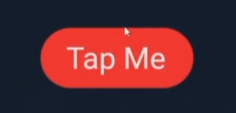
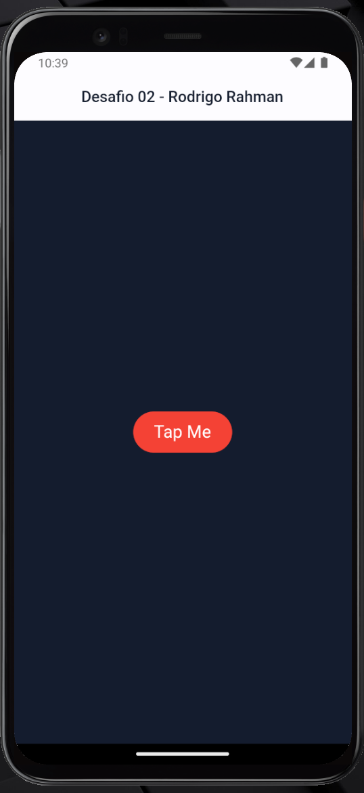

# Desafio 02 - Rodrigo Rahman

## Getting Started
[O desafio](https://www.instagram.com/p/Ctj89qUA9Zg/) proposto foi a criação do seguinte botão:



O resultado obtido foi o seguinte:



## Instalação e execução

```bash
# Clone este projeto
$ git clone https://github.com/vagnereix/rodrigo_rahman_challenge_02

# Acesse
$ cd rodrigo_rahman_challenge_02

# Abra no VSCode
$ code .

# Rode o projeto
```
